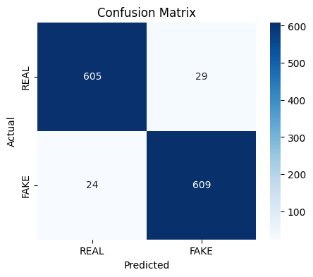
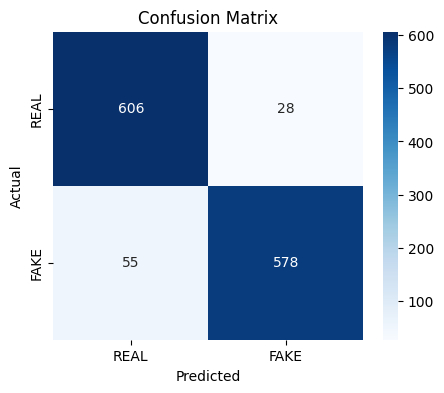

# Fake News Detection 
End-to-end data science project: load, clean, and analyze news articles, train/test a high-performance text classification model, evaluate results, and interpret features. Includes clear code, EDA, and practical suggestions for improvement.

## Table of Contents

- [Project Motivation](#project-motivation)
- [Project Structure](#project-structure)
- [Installation & Requirements](#installation--requirements)
- [Data Description](#data-description)
- [How to Run](#how-to-run)
- [Exploratory Data Analysis (EDA)](#exploratory-data-analysis-eda)
- [Text Preprocessing](#text-preprocessing)
- [Modeling](#modeling)
- [Results and Interpretation](#results-and-interpretation)
- [Limitations & Next Steps](#limitations--next-steps)
- [Contributors](#contributors)
- [License](#license)

## Project Motivation
The rapid spread of fake news through digital platforms threatens societal trust and decision-making. This project aims to build a reproducible, interpretable fake news classifier using state-of-the-art text features and proven machine learning algorithms.
## Project Structure
```jupyterpython
.
├── data/
│   └── news_data.csv
├── notebooks/
│   └── FakeNewsDetectionLinearSVC.ipynb
│   └── FakeNewsDetectionNavieBayes.ipynb
├── requirements.txt
├── README.md
└── LICENSE
```

## Installation & Requirements

### Clone the repository:
```bash
git clone https://github.com/NazmulHasanNihal/Fake-News-Detection.git
cd Fake-News-Detection
```
### Install dependencies:
```bash
pip install -r requirements.txt
```

## Data Description

- **Source :** `data/news_data.csv`

- **Columns :**

   - **title :** `Headline of the news article`

   - **text :** `Main text of the article`

   - **label :**  `"FAKE" or "REAL" (target variable)`

## How to Run

- **Data Preprocessing:**

    - `Clean and prepare the data using src/preprocess.py or via the Jupyter notebook.`

- **Model Training:**

    - `Train the Naive Bayes classifier on the processed data (src/train.py).`

- **Evaluation:**

    - `Evaluate model performance using src/evaluate.py or the provided notebook.`

**Or, simply run the Jupyter notebook in the `notebooks/` directory for an interactive, step-by-step workflow.**

## Exploratory Data Analysis (EDA)

- `No missing values in any column.`

- `Classes are perfectly balanced (REAL: 3171, FAKE: 3164).`

- `Four columns: id, title, text, and label (as expected).`

- `Most articles are under 6,254 characters, with a few much longer outliers.`

- `Right-skewed article length distribution, typical of news datasets.`

### Visualizing Class Distribution


### Checking Text Lengths and Nulls
```jupyterpython
count      6335.000000
mean       4773.528019
std        5091.586399
min          14.000000
25%        1804.500000
50%        3709.000000
75%        6254.500000
max      115448.000000
Name: content_length, dtype: float64
```


### Sample Articles

```markdown
Sample FAKE News:
You Can Smell Hillary’s Fear Daniel Greenfield, a Shillman Journalism Fellow at the Freedom Center, is a New York writer focusing on radical Islam.
In the final stretch of the election, Hillary Rodham Clinton has gone to war with the FBI.
The word “unprecedented” has been thrown around so often this election that it ought to be retired. But it’s still unprecedented for the nominee of a major political party to go war with the FBI.
But that’s exactly what Hillary and her people have done. Coma

Sample REAL News:
Kerry to go to Paris in gesture of sympathy U.S. Secretary of State John F. Kerry said Monday that he will stop in Paris later this week, amid criticism that no top American officials attended Sunday’s unity march against terrorism.

Kerry said he expects to arrive in Paris Thursday evening, as he heads home after a week abroad. He said he will fly to France at the conclusion of a series of meetings scheduled for Thursday in Sofia, Bulgaria. He plans to meet the next day with Foreign Minister La
```

### Key Observations

- `There are no missing values in any column.`

- `The classes are perfectly balanced (REAL: 3171, FAKE: 3164).`

- `The dataset contains four columns: id, title, text, and label (matching expectations).`

- `Most articles are under 6,254 characters, with a few much longer outliers.`

- `The histogram is right-skewed, showing typical news stories and rare long articles.`


## Text Preprocessing

### Combine Title and Text
```jupyterpython
df['content'] = df['title'].fillna('') + ' ' + df['text'].fillna('')
```
### Cleaning and Normalizing Text
```jupyterpython
import re
import nltk
from nltk.corpus import stopwords

nltk.download('stopwords')
stop_words = set(stopwords.words('english'))

def clean_text(text):
  text = text.lower()
  text = re.sub(r'[^a-z\s]', '', text)  # Remove non-alphabetical chars
  tokens = text.split()
  tokens = [word for word in tokens if word not in stop_words]
  return ' '.join(tokens)

data['content'] = data['content'].apply(clean_text)
```
### Train/Test Split
```jupyterpython
from sklearn.model_selection import train_test_split

X = data['content'] or X = data['text'] 
y = data['label'].map({'FAKE': 1, 'REAL': 0})

X_train, X_test, y_train, y_test = train_test_split(
  X, y, test_size=0.2, random_state=42, stratify=y
)
```
### Vectorization with TfidfVectorizer
```jupyterpython
from sklearn.feature_extraction.text import TfidfVectorizer

vectorizer = TfidfVectorizer(
    analyzer='word',
    stop_words='english',
    max_df=0.7,
    min_df=5,
    ngram_range=(1, 3),
    sublinear_tf=True,
    norm='l2', 
    smooth_idf=True,
    use_idf=True
)
X_train_tfidf = vectorizer.fit_transform(X_train)
X_test_tfidf = vectorizer.transform(X_test)
```
### Vectorization with CountVectorizer
```jupyterpython
from sklearn.feature_extraction.text import CountVectorizer

vectorizer = CountVectorizer(
    analyzer='word',
    stop_words='english',
    max_df=0.7,
    min_df=5,
    ngram_range=(1, 3),
    lowercase=True,
    binary=True                 
)

X_train_cv = vectorizer.fit_transform(X_train)
X_test_cv = vectorizer.transform(X_test)
```
### Feature Inspection and Output Shapes
#### Vocabulary Size
```jupyterpython
print(f"Vocabulary size: {len(vectorizer.get_feature_names_out())}")
```
**Output :**
```jupyterpython
Vocabulary size: 68824
```
#### Sample Features
```jupyterpython
print("Sample features:", vectorizer.get_feature_names_out()[:10])
```
**Output :**
```jupyterpython
Sample features: ['00' '00 pm' '000' '000 000' '000 000 pageviews' '000 according'
 '000 american' '000 american college' '000 americans' '000 bond']
```
#### Matrix Shapes
```jupyterpython
print("X_train_tfidf shape:", X_train_tfidf.shape)
print("X_test_tfidf shape:", X_test_tfidf.shape)
```
```jupyterpython
print("X_train_CountVectorizer shape:", X_train_cv.shape)
print("X_test_CountVectorizer shape:", X_test_cv.shape)
```
**Output :**
```jupyterpython
X_train_tfidf shape: (5068, 66078)
X_test_tfidf shape: (1267, 66078)
```
```jupyterpython
print("X_train_CountVectorizer shape:", X_train_cv.shape)
print("X_test_CountVectorizer shape:", X_test_cv.shape)
```
### Observations
- `The TfidfVectorizer extracted a vocabulary of 68,824 unique tokens from the training data, reflecting the diverse language used in news articles.`

- `Sample features include both numeric and alphanumeric terms (e.g., '00', '000 american', '000 bond'), illustrating the variety in news content.`

- `The feature matrices have shapes of (5,068, 66,078) for training and (1,267, 66,078) for testing, indicating each article is represented by thousands of features.`

- `Thorough preprocessing and feature extraction ensure the dataset is clean and well-structured, providing a strong foundation for model training and evaluation.`

## Modeling
## Model Comparison and Key Findings

- **Classifier Comparison:** 

   - **LinearSVC** — `chosen for its efficiency and strong performance on high-dimensional, sparse text data.`

   - **MultinomialNB (Naive Bayes)** — `a fast, interpretable baseline well-suited for text classification.`

- **Feature Extraction:**  

   - **TfidfVectorizer:**  

      - `Removes English stopwords` 

      - `Uses unigrams, bigrams, and trigrams (ngram_range=(1, 3))` 

      - `Limits features with max_df=0.7 and min_df=5 to reduce noise and overfitting ` 

      - `Applies sublinear term frequency scaling and L2 normalization`

   - **CountVectorizer:** 

      - `Removes English stopwords  `

      - `Uses unigrams, bigrams, and trigrams  `

      - `Limits features with max_df=0.7 and min_df=5  `

      - `Produces binary or count-based feature matrices`

- **Results:**  

   - **LinearSVC + TF-IDF:** `Achieved` **95.8% accuracy** `on the test set; precision and recall are balanced for both REAL and FAKE classes.`

   - **Naive Bayes + CountVectorizer:** `Achieved` **93.4% accuracy** `on the test set with fast training and interpretable feature weights.`

   - `Top predictive words for each class provide interpretability.`

   - `Confusion matrices for both models show low false positive and false negative rates.`

- **Summary:** 

   - `Both TF-IDF + LinearSVC and CountVectorizer + Naive Bayes provide robust, interpretable baselines for fake news detection. Naive Bayes is faster and easier to interpret, while LinearSVC offers slightly higher accuracy.`

### Training & Evaluation
#### LinearSVC & TfidfVectorizer
```jupyterpython
from sklearn.calibration import CalibratedClassifierCV
from sklearn.svm import LinearSVC

svc = LinearSVC()
calibrated_svc = CalibratedClassifierCV(svc)
calibrated_svc.fit(X_train_tfidf, y_train)

from sklearn.metrics import accuracy_score, classification_report, confusion_matrix

# Predict on train set
y_train_pred = calibrated_svc.predict(X_train_tfidf)

print("=== TRAIN SET ===")
print("Accuracy:", accuracy_score(y_train, y_train_pred))
print("\nClassification Report:\n", classification_report(y_train, y_train_pred, target_names=['REAL', 'FAKE']))
print("Confusion Matrix:\n", confusion_matrix(y_train, y_train_pred))

# Predict on test set
y_test_pred = calibrated_svc.predict(X_test_tfidf)

print("\n=== TEST SET ===")
print("Accuracy:", accuracy_score(y_test, y_test_pred))
print("\nClassification Report:\n", classification_report(y_test, y_test_pred, target_names=['REAL', 'FAKE']))
print("Confusion Matrix:\n", confusion_matrix(y_test, y_test_pred))
```
**Output :**
```jupyterpython
=== TRAIN SET ===
Accuracy: 1.0

Classification Report:
               precision    recall  f1-score   support

        REAL       1.00      1.00      1.00      2537
        FAKE       1.00      1.00      1.00      2531

    accuracy                           1.00      5068
   macro avg       1.00      1.00      1.00      5068
weighted avg       1.00      1.00      1.00      5068

Confusion Matrix:
 [[2537    0]
 [   0 2531]]

=== TEST SET ===
Accuracy: 0.9581689029202841

Classification Report:
               precision    recall  f1-score   support

        REAL       0.96      0.95      0.96       634
        FAKE       0.95      0.96      0.96       633

    accuracy                           0.96      1267
   macro avg       0.96      0.96      0.96      1267
weighted avg       0.96      0.96      0.96      1267

Confusion Matrix:
 [[605  29]
 [ 24 609]]
```


### Visualization of Confusion Matrix


#### Navie Bayes & CountVectorizer
```jupyterpython
from sklearn.naive_bayes import MultinomialNB

clf = MultinomialNB(alpha=0.01, class_prior=[0.3, 0.7])
clf.fit(X_train_cv, y_train)

from sklearn.metrics import accuracy_score, classification_report, confusion_matrix

# Predict on train set
y_train_pred = calibrated_svc.predict(X_train_tfidf)

print("=== TRAIN SET ===")
print("Accuracy:", accuracy_score(y_train, y_train_pred))
print("\nClassification Report:\n", classification_report(y_train, y_train_pred, target_names=['REAL', 'FAKE']))
print("Confusion Matrix:\n", confusion_matrix(y_train, y_train_pred))

# Predict on test set
y_test_pred = calibrated_svc.predict(X_test_tfidf)

print("\n=== TEST SET ===")
print("Accuracy:", accuracy_score(y_test, y_test_pred))
print("\nClassification Report:\n", classification_report(y_test, y_test_pred, target_names=['REAL', 'FAKE']))
print("Confusion Matrix:\n", confusion_matrix(y_test, y_test_pred))
```
**Output :**
```jupyterpython
=== TRAIN SET ===
Accuracy: 0.9753354380426204

Classification Report:
               precision    recall  f1-score   support

        REAL       0.96      0.99      0.98      2537
        FAKE       0.99      0.96      0.97      2531

    accuracy                           0.98      5068
   macro avg       0.98      0.98      0.98      5068
weighted avg       0.98      0.98      0.98      5068

Confusion Matrix:
 [[2507   30]
 [  95 2436]]

=== TEST SET ===
Accuracy: 0.9344909234411997

Classification Report:
               precision    recall  f1-score   support

        REAL       0.92      0.96      0.94       634
        FAKE       0.95      0.91      0.93       633

    accuracy                           0.93      1267
   macro avg       0.94      0.93      0.93      1267
weighted avg       0.94      0.93      0.93      1267

Confusion Matrix:
 [[606  28]
 [ 55 578]]
```
### Visualization of Confusion Matrix


## Results and Interpretation

### Performance

- **TF-IDF + LinearSVC:**` Achieved` **95.8% accuracy** `on the test set, with balanced precision and recall for both REAL and FAKE news classes.`

- **Naive Bayes + CountVectorizer:** `Achieved` **93.4% accuracy** `on the test set, offering fast training and interpretable feature weights.`

- **Confusion Matrices:** `Both models show low false positive and false negative rates, indicating reliable classification.`

- **Feature Importance:** `Top predictive words for each class provide transparency into the language patterns the models use to distinguish REAL from FAKE news.`

- **Generalization:** `The models maintain high accuracy on unseen data, suggesting good generalization within the dataset's domain.`

- **Speed and Efficiency:** `Naive Bayes is notably faster to train and predict, making it suitable for large-scale or real-time applications, while LinearSVC offers slightly better accuracy at the cost of increased computation.`

### Interpretation

- `The strong results highlight the effectiveness of traditional machine learning methods (LinearSVC, Naive Bayes) for text-based fake news detection, especially with a clean and balanced dataset.`

- `Balanced metrics confirm that the models do not systematically favor one class over another.`

- `Feature analysis supports interpretability, allowing users to understand which terms most influence predictions and providing actionable insights for further model improvement.`

- **Practical Implications:** `These models can serve as robust baselines for automated fake news detection systems, and their interpretability helps build trust with end-users and stakeholders.`

- **Limitations:** `While performance is strong, the models may struggle with nuanced language, sarcasm, or news from domains not represented in the training data, highlighting the need for ongoing evaluation and potential integration with more advanced NLP techniques.`

- **Next Steps:** `Further improvements could include incorporating metadata, leveraging deep learning models, or performing detailed error analysis to address edge cases and improve robustness.`

## Limitations & Next Steps
### Limitations

- **Context limitation:** `Linear models and bag-of-words/TF-IDF features are limited in capturing deep context, sarcasm, or complex semantic relationships, which can lead to misclassification of nuanced articles.`

- **Generalization:** `The models may not perform as well on news from unfamiliar sources, emerging topics, or domains not present in the training data, highlighting a risk of domain adaptation issues.`

- **Feature independence:** `Naive Bayes and similar models assume feature independence, which does not reflect the true dependencies in natural language, potentially limiting predictive power.`

- **Lack of metadata:** `The current approach relies solely on textual content; integrating metadata (such as publication date, author, or source credibility) could enhance model accuracy and robustness.`

- **Dataset limitations:** `The dataset is balanced and clean, but may not reflect real-world class imbalance or the diversity of fake news encountered in production environments.`

### Next Steps

- **Enhanced preprocessing:** `Apply lemmatization, named entity recognition, and advanced text normalization to improve feature quality and reduce noise.`

- **Model ensembling:** `Explore stacking or blending multiple classifiers (e.g., LinearSVC, Logistic Regression, Naive Bayes) to leverage complementary strengths and improve overall performance.`

- **Deep learning integration:** `Experiment with transformer-based models (such as BERT or RoBERTa) to capture richer language representations and context, aiming for higher accuracy and adaptability.`

- **Comprehensive error analysis:** `Conduct detailed analysis of misclassified samples to identify systematic weaknesses and guide targeted improvements.`

- **Data augmentation:** `Expand the dataset with more recent, diverse, and multilingual news articles to improve generalization and robustness against evolving fake news tactics.`

- **Real-world evaluation:** `Test the models on external datasets or in live settings to assess performance under realistic conditions and address potential deployment challenges.`


## Contributors
[Nazmul Hasan Nihal](mailto:nazmulhas36@gmail.com)
## License
MIT License 


