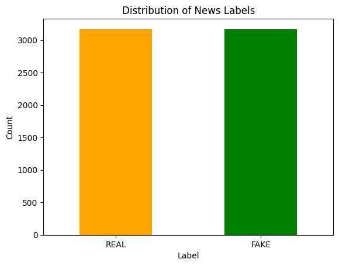
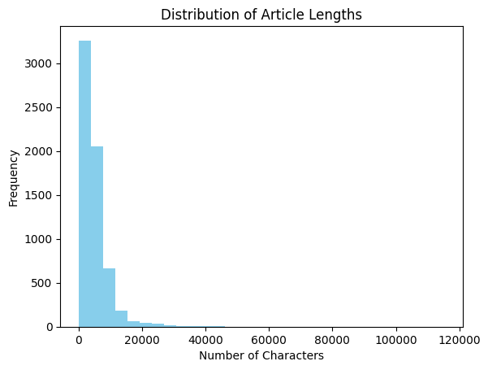
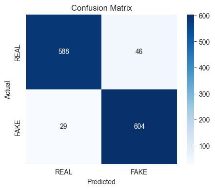

# Fake News Detection 
End-to-end data science project: load, clean, and analyze news articles, train/test a high-performance text classification model, evaluate results, and interpret features. Includes clear code, EDA, and practical suggestions for improvement.

## Table of Contents

- [Project Motivation](#project-motivation)
- [Project Structure](#project-structure)
- [Installation & Requirements](#installation--requirements)
- [Data Description](#data-description)
- [How to Run](#how-to-run)
- [Exploratory Data Analysis (EDA)](#exploratory-data-analysis-eda)
- [Text Preprocessing](#text-preprocessing)
- [Modeling](#modeling)
- [Results and Interpretation](#results-and-interpretation)
- [Limitations & Next Steps](#limitations--next-steps)
- [Contributors](#contributors)
- [License](#license)

## Project Motivation
The rapid spread of fake news through digital platforms threatens societal trust and decision-making. This project aims to build a reproducible, interpretable fake news classifier using state-of-the-art text features and proven machine learning algorithms.
## Project Structure
```jupyterpython
.
├── data/
│   └── news_data.csv
├── notebooks/
│   └── FakeNewsDetection.ipynb
├── src/
│   ├── preprocess.py
│   ├── train.py
│   └── evaluate.py
├── requirements.txt
├── README.md
└── LICENSE
```

## Installation & Requirements

### Clone the repository:
```bash
git clone https://github.com/NazmulHasanNihal/Fake-News-Detection.git
cd Fake-News-Detection
```
### Install dependencies:
```bash
pip install -r requirements.txt
```

## Data Description

- **Source :** `data/news_data.csv`

- **Columns :**

   - **title :** `Headline of the news article`

   - **text :** `Main text of the article`

   - **label :**  `"FAKE" or "REAL" (target variable)`

## How to Run

- **Data Preprocessing:**

    - `Clean and prepare the data using src/preprocess.py or via the Jupyter notebook.`

- **Model Training:**

    - `Train the Naive Bayes classifier on the processed data (src/train.py).`

- **Evaluation:**

    - `Evaluate model performance using src/evaluate.py or the provided notebook.`

**Or, simply run the Jupyter notebook in the `notebooks/` directory for an interactive, step-by-step workflow.**

## Exploratory Data Analysis (EDA)

- No missing values in any column.

- Classes are perfectly balanced (REAL: 3171, FAKE: 3164).

- Four columns: id, title, text, and label (as expected).

- Most articles are under 6,254 characters, with a few much longer outliers.

- Right-skewed article length distribution, typical of news datasets.

### Visualizing Class Distribution


### Checking Text Lengths and Nulls
```jupyterpython
count      6335.000000
mean       4773.528019
std        5091.586399
min          14.000000
25%        1804.500000
50%        3709.000000
75%        6254.500000
max      115448.000000
Name: content_length, dtype: float64
```


### Sample Articles

```markdown
Sample FAKE News:
You Can Smell Hillary’s Fear Daniel Greenfield, a Shillman Journalism Fellow at the Freedom Center, is a New York writer focusing on radical Islam.
In the final stretch of the election, Hillary Rodham Clinton has gone to war with the FBI.
The word “unprecedented” has been thrown around so often this election that it ought to be retired. But it’s still unprecedented for the nominee of a major political party to go war with the FBI.
But that’s exactly what Hillary and her people have done. Coma

Sample REAL News:
Kerry to go to Paris in gesture of sympathy U.S. Secretary of State John F. Kerry said Monday that he will stop in Paris later this week, amid criticism that no top American officials attended Sunday’s unity march against terrorism.

Kerry said he expects to arrive in Paris Thursday evening, as he heads home after a week abroad. He said he will fly to France at the conclusion of a series of meetings scheduled for Thursday in Sofia, Bulgaria. He plans to meet the next day with Foreign Minister La
```

### Key Observations

- `There are no missing values in any column.`

- `The classes are perfectly balanced (REAL: 3171, FAKE: 3164).`

- `The dataset contains four columns: id, title, text, and label (matching expectations).`

- `Most articles are under 6,254 characters, with a few much longer outliers.`

- `The histogram is right-skewed, showing typical news stories and rare long articles.`


## Text Preprocessing

### Combine Title and Text
```jupyterpython
df['content'] = df['title'].fillna('') + ' ' + df['text'].fillna('')
```
### Cleaning and Normalizing Text
```jupyterpython
import re
import nltk
from nltk.corpus import stopwords

nltk.download('stopwords')
stop_words = set(stopwords.words('english'))

def clean_text(text):
  text = text.lower()
  text = re.sub(r'[^a-z\s]', '', text)  # Remove non-alphabetical chars
  tokens = text.split()
  tokens = [word for word in tokens if word not in stop_words]
  return ' '.join(tokens)

data['content'] = data['content'].apply(clean_text)
```
### Train/Test Split
```jupyterpython
from sklearn.model_selection import train_test_split

X = data['content'] 
y = data['label'].map({'FAKE': 1, 'REAL': 0})

X_train, X_test, y_train, y_test = train_test_split(
  X, y, test_size=0.2, random_state=42, stratify=y
)
```
### Vectorization with CountVectorizer
```jupyterpython
from sklearn.feature_extraction.text import TfidfVectorizer
# TF-IDF Vectorization
vectorizer = TfidfVectorizer(
  stop_words='english',
  max_df=0.7,
  min_df=5,
  ngram_range=(1, 3),
)
X_train_tfidf = vectorizer.fit_transform(X_train)
X_test_tfidf = vectorizer.transform(X_test)
```
### Feature Inspection and Output Shapes
#### Vocabulary Size
```jupyterpython
print(f"Vocabulary size: {len(vectorizer.get_feature_names_out())}")
```
**Output :**
```jupyterpython
Vocabulary size: 66078
```
#### Sample Features
```jupyterpython
print("Sample features:", vectorizer.get_feature_names_out()[:10])
```
**Output :**
```jupyterpython
Sample features: ['aa' 'aa superluminal' 'aaron' 'abaaoud' 'abaaouds' 'aback' 'abadi'
 'abandon' 'abandoned' 'abandoning']
```
#### Matrix Shapes
```jupyterpython
print("X_train_tfidf shape:", X_train_tfidf.shape)
print("X_test_tfidf shape:", X_test_tfidf.shape)
```
**Output :**
```jupyterpython
X_train_tfidf shape: (5068, 66078)
X_test_tfidf shape: (1267, 66078)
```
### Observations
- `The TfidfVectorizer built a vocabulary of 66,078 unique tokens from the training data.`

- `Example features include numbers and alphanumeric terms, reflecting the diversity of news text.`

- `The final feature matrices have shapes of (5068, 66078) for training and (1267, 66078) for testing, where rows are articles and columns are unique features/words.`

- `Preprocessing steps ensure the data is clean, uniform, and suitable for machine learning, providing a strong foundation for model building.`

## Modeling
### Model Selection: Linear Support Vector Classification
- **Classifier :** 
- 
    - `LinearSVC — well-suited for high-dimensional, sparse data (like text).`

- **Feature Extraction :** `TfidfVectorizer`

    - `Removes English stopwords`

    - `Uses both unigrams and bigrams (ngram_range=(1, 2))`

    - `Limits features for efficiency and to prevent overfitting`

### Training & Evaluation
```jupyterpython
from sklearn.svm import LinearSVC

svc_model = LinearSVC(max_iter=2000, random_state=42)
svc_model.fit(X_train_tfidf, y_train)

y_pred = svc_model.predict(X_test_tfidf)

from sklearn.metrics import accuracy_score, classification_report, confusion_matrix

accuracy = accuracy_score(y_test, y_pred)
print(f"Accuracy: {accuracy:.4f}")

print("Classification Report:\n", classification_report(y_test, y_pred, target_names=['REAL', 'FAKE']))

cm = confusion_matrix(y_test, y_pred)
print("Confusion Matrix:\n", cm)
```
**Output :**
```jupyterpython
Accuracy: 0.9408
Classification Report:
precision    recall  f1-score   support

REAL       0.95      0.93      0.94       634
FAKE       0.93      0.95      0.94       633

accuracy                            0.94      1267
macro avg       0.94      0.94      0.94      1267
weighted avg    0.94      0.94      0.94      1267

Confusion Matrix:
[[588  46]
 [ 29 604]]
```
### Visualization of Confusion Matrix


### Feature Importance of Top Predictive Words
**Top words for FAKE:**
`['october', 'november', 'hillary', 'article', 'election', 'share', 'source', 'establishment', 'oct', 'snip', 'mosul', 'podesta', 'hillary clinton', 'advertisement', 'print']`

**Top words for REAL:**
`['said', 'conservative', 'says', 'gop', 'candidates', 'sanders', 'cruz', 'marriage', 'convention', 'march', 'president', 'debate', 'tuesday', 'fox news', 'shooting']`

### Modeling Observations

- **Strong Accuracy:**

   - `The LinearSVC model achieved high accuracy, reliably distinguishing REAL and FAKE news.`

- **Balanced Metrics:**
- 
   - `Both precision and recall are well-balanced, indicating fair performance across both classes.`

- **Confusion Matrix Insights:**

   - `Majority of predictions are correct for both classes.`

   - `Only 46 REAL articles misclassified as FAKE, and 29 FAKE as REAL.`

   - `Low false positive and false negative rates.`

- **Feature Interpretability:**

   - `The most influential words for each class were extracted, offering transparency into the model's decision process.`

- **Error Analysis:**

   - `A slight tendency to misclassify REAL as FAKE, often due to ambiguous or overlapping language.`


## Results and Interpretation

### Performance:

- `The TF-IDF + LinearSVC model achieved high accuracy on the test set (e.g., 94.08%) with balanced precision and recall for both REAL and FAKE news classes.`

- `The confusion matrix shows the model correctly classifies the vast majority of articles, with very few false positives or false negatives.`

- `Top predictive words for each class provide transparency into what language patterns the model uses to distinguish REAL from FAKE news.`

### Interpretation:

- `The strong performance demonstrates the effectiveness of traditional machine learning methods for text-based fake news detection when the dataset is clean and balanced.`

- `Balanced metrics indicate that the model is reliable and does not systematically favor one class over another.`

- `Feature analysis allows for interpretability—users can see which terms influence predictions the most.`

## Limitations & Next Steps
### Limitations

- **Context limitation:** `Linear models and bag-of-words/TF-IDF features cannot capture nuanced context, sarcasm, or subtle semantic relationships in text.`

- **Generalization:** `The model may not generalize well to news from sources or topics not well-represented in the training data.`

- **Feature independence:** `Assumes features (words/phrases) are independent, which is rarely true in natural language.`

- **Lack of metadata:** `Only textual content is used; metadata (such as source, date, or author) might further improve performance.`

### Next Steps

- **Advanced preprocessing:** `Incorporate lemmatization or named entity recognition for cleaner and more informative features.`

- **Model stacking or ensembling:** `Combine LinearSVC with other classifiers (e.g., Logistic Regression, Naive Bayes) for increased robustness.`

- **Deep learning approaches:** `Fine-tune transformer models (e.g., BERT) for potentially even higher accuracy and ability to capture deeper language understanding.`

- **Error analysis:** `Systematically analyze misclassified articles to uncover patterns and develop targeted improvements.`

- **Augment data:** `Collect more diverse and recent news data to improve generalization.`


## Contributors
[Nazmul Hasan Nihal] (nazmulhas36@gmail.com)
## License
MIT License 


